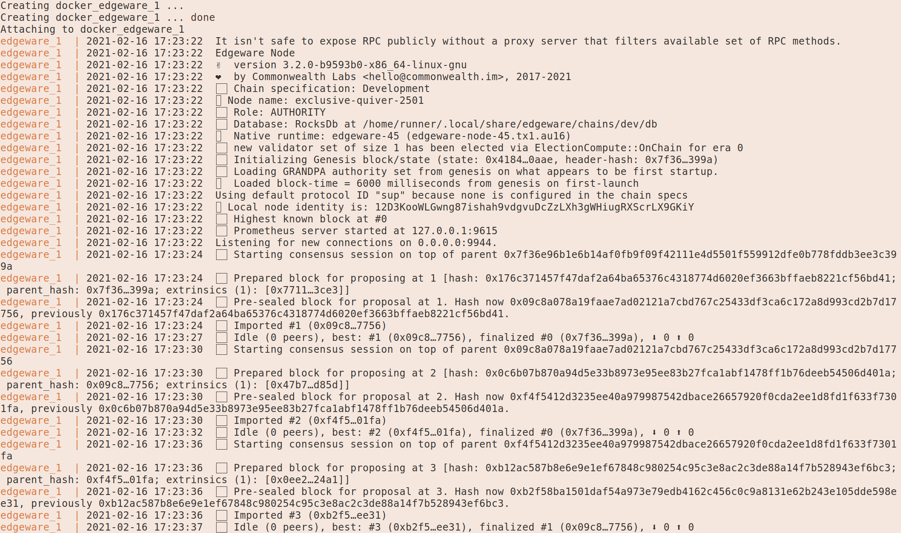

### Setting up a Edgeware Node for Ethereum/EVM development

This guide gives you steps to create a node for testing the Ethereum compatibility functionality of Edgeware EVM

> **Note** This is fast track way to run your node for great Developer Experience, [you can always opt-out for compile it from source](https://github.com/hicommonwealth/edgeware-node/tree/edgeware-frontier) to be sure. We recommend to use your own compiled binaries for production mainnet.

> **Note** If you don't have [Docker installed, you can quickly install it from here](https://docs.docker.com/get-docker/)

You will clone our repo with various docker-compose files and run it right away:

```shell
git clone https://github.com/yangwao/substrate_playground; cd substrate_playground;
docker-compose -f edgeware_frontier.yml up
```
> **Note** If you want to flush data, delete docker container `docker-compose -f edgeware_frontier.yml rm` 

You will see something like this



> **Note** If you want to reset or purge chain locally, remove container with `docker-compose -f edgeware_frontier.yml rm`

Afterwards you can head to [Polkadot Apps and connect to 127.0.0.1:9944](https://polkadot.js.org/apps/?rpc=ws%3A%2F%2F127.0.0.1%3A9944#/explorer) and you should see block producing in explorer.


Now you can continue to connect your [Metamask](4/interacting-with-a-Edgeware-node-using-metamask.md), Remix or Web3 to have great experience.

### We want to hear from you

This is obviously a simple example, but it provides context for how you can start working with Edgeware and how you can try out it's Ethereum compability features. We are interested in hearing abou your experience and following the steps in this guide or your experience trying other Etheruem-based tools with Edgeware. [Feel free to join us in the channels (Discord, Element, Telegram)](https://linktr.ee/edg_developers). We would love to hear your feedback on Edgeware EVM and answer any questions that you may have.